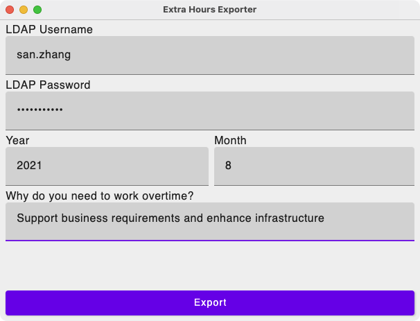

Extra Hours Exporter
===



## Usage

Windows users can download binary distribution from [Release Page], but the dmg package for macOS
is broken because no-signed.

For macOS users, you can build and run from source code.

Jetpack Compose required JDK11+.

```shell
export JAVA_HOME=/jdk11/path
./gradlew run
```
